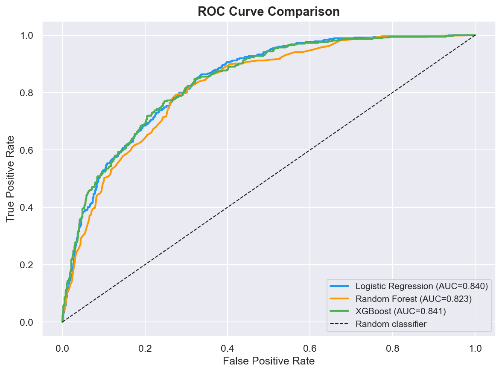
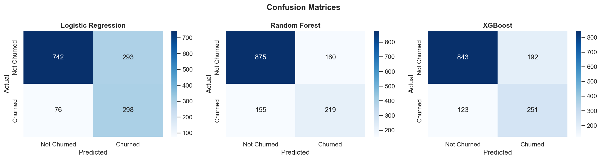
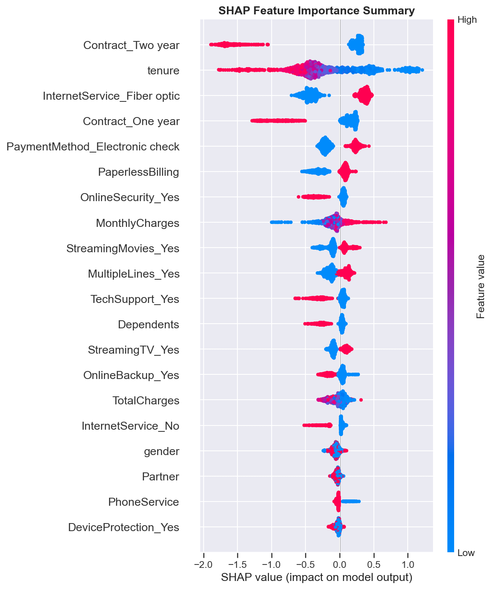
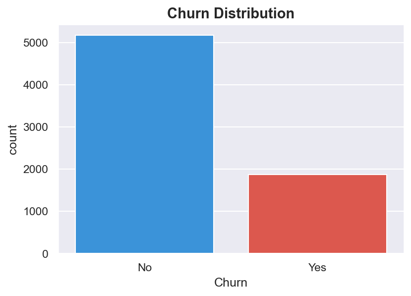

# Customer Churn Prediction (XGBoost + SHAP)

## Overview
A classification project to predict customer churn, with a focus on handling class imbalance and explaining model predictions for business stakeholders.

## Key Results
- **Model:** XGBoost Classifier with SMOTE for class imbalance correction
- **Performance:** ROC-AUC = 0.841
- **Explainability:** SHAP values used to interpret feature importance and individual predictions
- **Threshold Tuning:** Classification threshold optimized to improve Recall, prioritizing catching at-risk customers over overall accuracy

## Tools Used
- Python
- Pandas, NumPy (data handling)
- XGBoost (modeling)
- imbalanced-learn / SMOTE (class imbalance handling)
- SHAP (model explainability)

## Process
1. **Data Cleaning & EDA** — Explored churn patterns and class distribution across the dataset
2. **Handling Class Imbalance** — Applied SMOTE to oversample the minority (churn) class before training, avoiding data leakage by fitting SMOTE only on training data
3. **Model Training** — Trained an XGBoost classifier on the balanced dataset
4. **Threshold Tuning** — Adjusted the default 0.5 classification threshold to optimize Recall, since missing a churn-risk customer is costlier than a false alarm
5. **Model Explainability** — Used SHAP to identify which features most influenced churn predictions, both globally and for individual customers
6. **Evaluation** — Achieved ROC-AUC of 0.841 on the test set

## Files
- `churn_prediction.ipynb` — Full notebook with preprocessing, SMOTE pipeline, model training, threshold tuning, and SHAP analysis

## Screenshots

### ROC Curve

### Confusion Matrix

### SHAP Summary Plot

### Churn Distribution 

## Dataset
*(Add dataset source/link here)*
